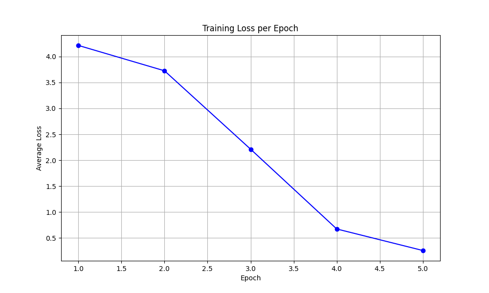
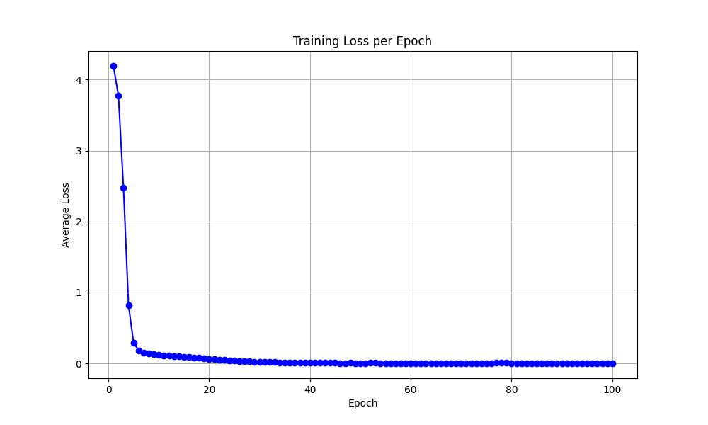
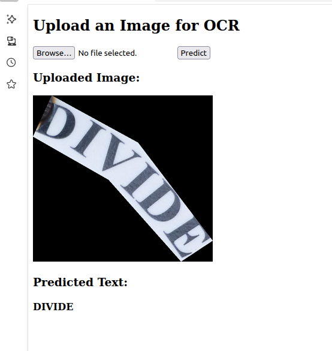
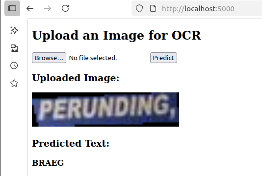

# OCR Dataset Processing and Model Training

## 📁 Dataset Structure

The dataset is organized as:
images/
├── train/
├── test/
└── groundtruth/

Each annotation in the ground truth consists of:
- `x`: X-coordinates of the polygon
- `y`: Y-coordinates of the polygon
- `ornt`: Orientation (e.g., 'm', 'h', 'c', or '#')
- `transcriptions`: The actual text content

### 🧾 Example Ground Truth Entries

x: [[115 503 494 115]], y: [[322 346 426 404]], ornt: ['m'], transcriptions: ['nauGHTY']
x: [[734 1058 1061 744]], y: [[360 369 449 430]], ornt: ['m'], transcriptions: ['NURIS']
x: [[558 682 682 557]], y: [[370 375 404 398]], ornt: ['m'], transcriptions: ['NURIS']
x: [[562 595 651 687 653 637 604 588]], y: [[347 304 305 360 366 334 332 361]], ornt: ['c'], transcriptions: ['nauGHTY']
x: [[603 632 630 603]], y: [[408 413 426 423]], ornt: ['h'], transcriptions: ['EST']
x: [[599 638 637 596]], y: [[419 422 441 437]], ornt: ['h'], transcriptions: ['1996']
x: [[583 602 633 656 679 648 594 558]], y: [[410 445 445 411 428 476 472 432]], ornt: ['c'], transcriptions: ['warunG']
x: [[543 583 660 701 691 653 592 557]], y: [[347 288 288 347 358 308 302 355]], ornt: ['#'], transcriptions: ['#']
x: [[557 580 640 683 698 649 583 537]], y: [[419 470 481 422 432 497 491 432]], ornt: ['#'], transcriptions: ['#']

---

## ⚙️ Preprocessing

The script `preprocess.py` performs the following steps:

1. Downloads and extracts image and annotation data.
2. Crops images based on polygon coordinates and associated transcriptions.
3. Saves the cropped image patches into a new folder: `cropped/`

---

## 🔬 Experiments

### 1️⃣ Direct Evaluation Using Pre-trained Model

- Used a pre-trained OCR model (e.g., TrOCR) directly on the cropped dataset.
- Predictions saved to `cropped/predictions.csv`
- Precision computed using [`cal_precision_TrOCR_direct.py`](cal_precision_TrOCR_direct.py)

📊 **Result:**

- Exact Match Precision: 0.1386 (306 / 2208)

---

### 2️⃣ Fine-tuning Attempt

Fine-tuning the pre-trained model was attempted but could not be continued due to compute limitations.

---

### 3️⃣ Custom Baseline Model

A simple custom model was implemented and trained on the dataset.

📈 **Performance Metrics:**

| Epoch | Training Precision | Test Precision |
|-------|--------------------|----------------|
| 5     | 0.9250             | 0.9450         |
| 100   | 1.0000             | 0.9475         |

- All results saved in: `result_base_model/`
- Graphs:
  - 
  - 

---

## 🌐 Flask Web App

A simple Flask app was created to run the trained OCR model on uploaded images.

📂 Location: `flask/`

🖼️ Example Screenshots:
- 
- 

---

## 📌 Notes

- Replace the image links (``) with actual image paths as needed.
- For future improvements, include model weights, a training log, and dockerized deployment options.

---
